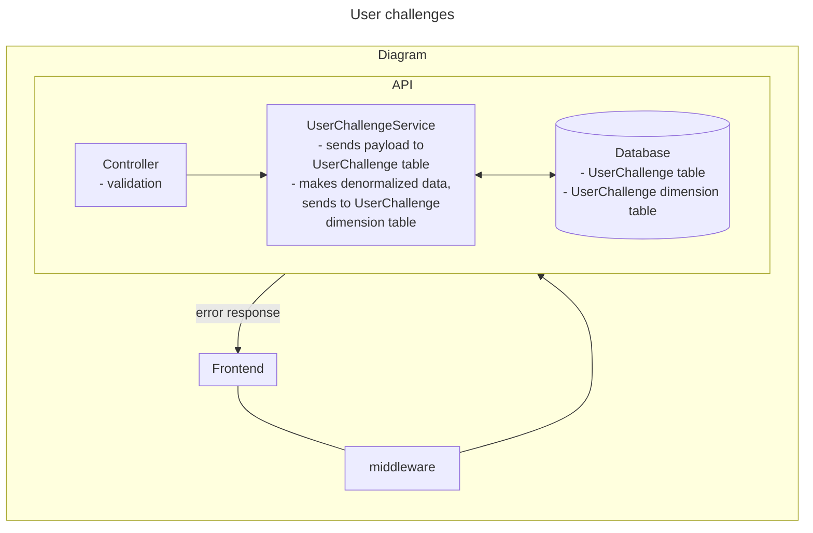

```mermaid

---
title: User challenges
---
flowchart LR
    subgraph Diagram
        subgraph F["Frontend"]
        end
        F[Frontend] --- middleware
        middleware --> API
        subgraph API
            Controller["`Controller
            - validation
            `"]
            U["`UserChallengeService
            - sends payload to
            UserChallenge table
            - makes denormalized data,
            sends to UserChallenge
             dimension table`"]
            Database[(Database)]
            Controller --> U
            U <--> Database[("`Database
            - UserChallenge table
            - UserChallenge dimension table
            `")]
        end
        API -- error response --> F
    end

```
